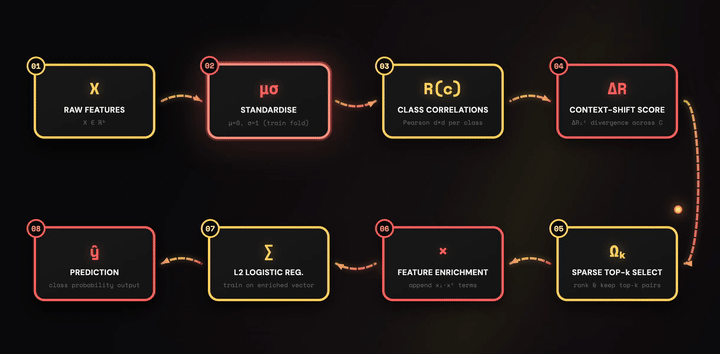
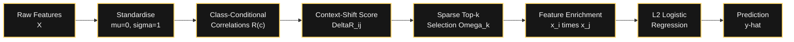
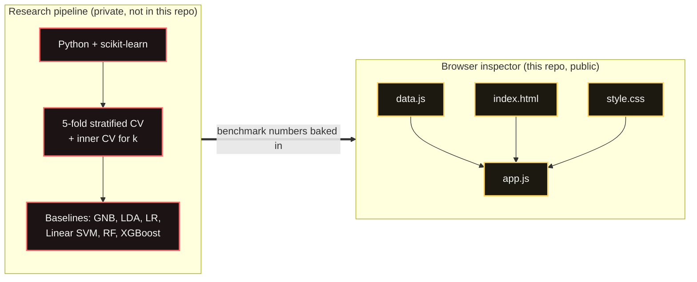
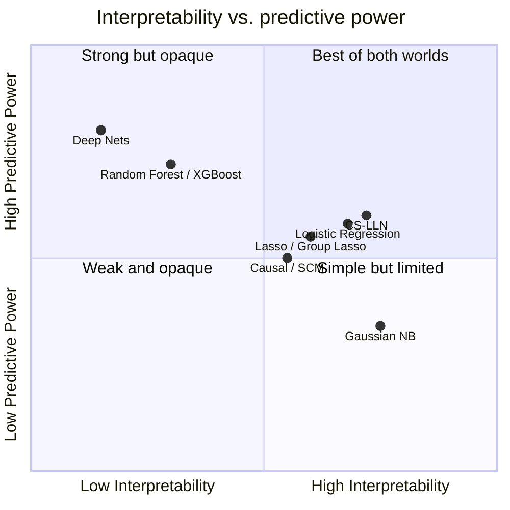
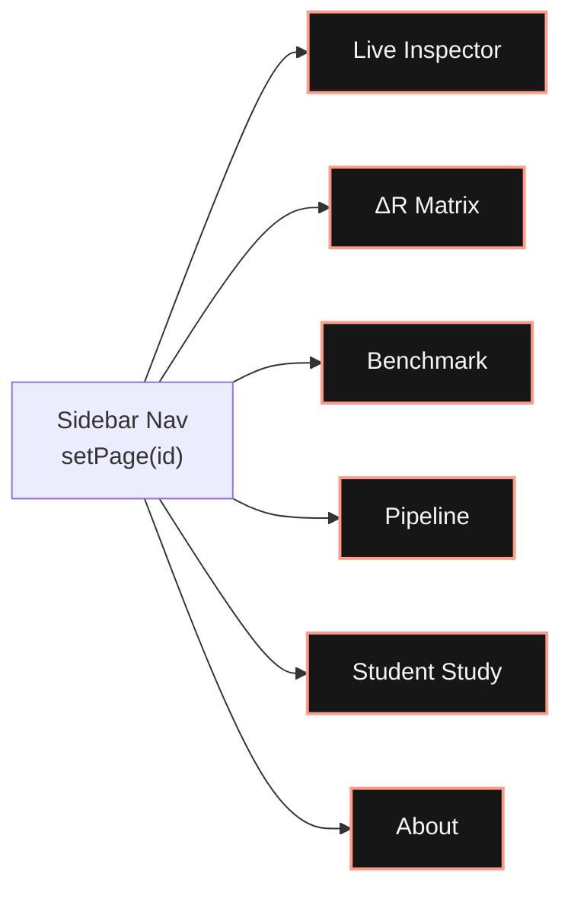

# CS-LLN Inspector

**An interactive research companion for Context-Shift Interaction Screening - a sparse, closed-form way to teach Naive Bayes about feature interactions it would otherwise miss.**

[](https://1mystic.github.io/CS-LLN/)



<p align="center"><sub>Animated pipeline diagram, source in <a href="architecture-diagram.html"><code>architecture-diagram.html</code></a>, recorded to GIF</sub></p>

> "Context-Shift Interaction Screening for Feature-Enriched Classification: A Sparse, Closed-Form Approach Beyond the Naive Independence Assumption"

---

## What this is

Naive Bayes assumes every feature is conditionally independent given the class - an assumption that quietly breaks whenever two features move together *differently* depending on the class. **CS-LLN (Context-Shift Log-Linear Network)** finds exactly those feature pairs, using a single closed-form statistic:

```
ΔRij = (2 / C(C-1)) × Σ_{m<n} |R(m)_ij − R(n)_ij|
```

`R(c)_ij` is the Pearson correlation between features `i` and `j` within class `c`. A high `ΔRij` means the relationship between two features shifts across classes - a signal Naive Bayes is structurally blind to. CS-LLN ranks all pairs by `ΔRij`, keeps a **sparse top-k**, appends those interaction terms (`xi · xj`) to the feature space, and fits a plain L2-regularised logistic regression on top - no gradient descent needed for the screening step itself.

This repository hosts the **live, in-browser inspector**: pick a dataset, drag the feature sliders, and watch the `ΔRij` heatmap, the selected interaction pairs, and the classifier's live prediction update in real time. Everything runs client-side - no server, no build step.

**[→ Open the live inspector](https://1mystic.github.io/CS-LLN/)**  ·  **[→ End-to-end walkthrough (Google Colab)](https://colab.research.google.com/drive/1Zyb8fvWJZluv18YONjHcAHGaKLmDK9Yl?usp=sharing)**

<sub>Note: the Colab notebook is kept private to prevent any publication issues with the underlying research; request view access if you'd like to review it.</sub>

---

## Why it's interesting

| Dataset | Features (d) | Classes | Selected pairs (k) | CS-LLN Accuracy | Best baseline |
|---|---|---|---|---|---|
| Breast Cancer Wisconsin | 30 | 2 | 45 / 435 | **97.72% ± 1.6** | LR 97.37% |
| Wine Recognition | 13 | 3 | 5 / 78 | **98.89% ± 1.4** | LR 98.33% |
| Iris | 4 | 3 | 5 / 6 | 96.67% ± 4.2 | LDA 97.33% |
| Student Performance (real, N=213) | 14 | 3 | 5 / 91 | 66.69% ± 6.9 | LR 69.48% |

On Breast Cancer Wisconsin, a **6.2× smaller** interaction set than the full quadratic expansion cuts classification error by **63%** relative to Gaussian Naive Bayes, and improves log-loss roughly **10×** (0.777 → 0.078) - evidence that the *right* handful of interactions matters more than adding all of them.

The method was also validated on a real, anonymized dataset of 213 CSE undergraduates (14 features, 3 CGPA-band classes), where the top selected pair (a quiz × lab-marks interaction) surfaces an interpretable "withdrawal spiral" signal - see the **STUDENT STUDY** tab on the live site.

---

## How the algorithm works

| Step | What happens |
|---|---|
| **1. Standardise** | Zero-mean, unit-variance each feature (training-fold statistics only - no leakage). |
| **2. Class-conditional correlations** | For each class `c`, compute a `d×d` Pearson correlation matrix `R(c)`. |
| **3. Context-shift scoring** | Compute `ΔRij` - the mean absolute divergence of `R(c)_ij` across all class pairs. |
| **4. Sparse pair selection** | Rank all `C(d,2)` feature pairs by `ΔRij`, keep the top-k. |
| **5. Enrich + classify** | Append product terms `xi·xj` for the selected pairs; fit L2-regularised logistic regression on the enriched vector. The decision boundary is linear in the enriched space but quadratic in the original feature space. |

**Complexity:** `O(Nd²)` for the class correlations, `O(d² log d)` to rank pairs, `O(N(d+k)·iters)` to train - the screening phase itself is entirely closed-form, with no gradient computation.



---

## Architecture

There are two layers to this project, and it's worth being explicit about the boundary between them:



- **Research pipeline.** The benchmark numbers (accuracy, log-loss, F1, per-fold splits) were produced offline with scikit-learn: stratified 5-fold CV, inner CV for hyperparameter `k`, and baselines (Gaussian NB, LDA, Logistic Regression, Linear SVM, Random Forest, XGBoost) run under identical folds for a fair comparison. This code isn't in the public repo (see [Repository layout](#repository-layout)) - the *outputs* of it are.
- **Browser inspector.** `app.js` re-implements the CS-LLN pipeline (steps 1–5 above) in plain JavaScript so it can run **live, client-side**, on the *Live Inspector* and *Student Study* pages: as you drag a slider, the class-conditional correlations, `ΔRij`, pair selection, and one-vs-rest logistic regression all re-run in the browser. The *ΔR Matrix* and *Benchmark* pages instead render pre-computed tables/heatmaps from the research pipeline - they're not simulated, they're the same numbers, just not re-derived in JS on every load.
- **One-vs-Rest for multi-class.** Both the research pipeline and the browser reproduction use the same OvR-with-softmax scheme, so results are directly comparable across binary (Breast Cancer) and 3-class (Iris, Wine, Student) problems.

---

## Assumptions

CS-LLN's screening step rests on a small number of explicit assumptions - worth stating up front, since they define where the method helps and where it won't:

- **Continuous features.** `ΔRij` is built on Pearson correlation, which assumes continuous (or at least interval-scaled) inputs. Categorical or ordinal features need a different correlation measure (polychoric, Spearman) before this applies - not implemented here.
- **`Nc ≥ 2d` per class.** Class-conditional correlation matrices need enough samples per class relative to dimensionality to be numerically stable. Small or heavily imbalanced classes weaken the screening signal before they weaken the classifier.
- **Pairwise, multiplicative interactions are the relevant nonlinearity.** The enrichment step only adds `xi·xj` terms for selected pairs - it assumes second-order products capture the useful nonlinear structure, not higher-order (three-way+) interactions or non-multiplicative nonlinearities.
- **Correlation *shift* (not magnitude) is the informative signal.** A pair with `ΔRij ≈ 0` may still be strongly correlated overall - CS-LLN doesn't care, because a *consistent* correlation is something a linear/NB boundary can already absorb. Only class-dependent shifts are actionable for a discriminative boundary.
- **`k` is a tunable, not a given.** The sparse cutoff is chosen by cross-validation per dataset - the method doesn't derive it in closed form, only the *ranking* it selects from is closed-form.

---

## Strengths

- **Interpretable by construction.** Every selected interaction is a named, human-readable feature pair with an explicit score - you can point to *why* a prediction changed, not just *that* it did.
- **Closed-form, gradient-free screening.** Steps 1–4 are pure linear algebra (correlations + sort) - no iterative optimisation, no convergence tuning, before you ever fit the final classifier.
- **Genuinely sparse.** On Breast Cancer Wisconsin, 45 of 435 possible pairs (6.2× fewer than the full quadratic expansion) capture essentially all of the usable interaction signal - see the k-ablation curve on the *ΔR Matrix* page, which plateaus well before k=78.
- **Large, consistent win over Gaussian Naive Bayes** - the model it's positioned to replace - across every dataset tested (+4.75pp / 63% error reduction on Breast Cancer, +1.14pp on Wine, +2.00pp on Iris, +6.13pp on the real student dataset).
- **One code path for binary and multi-class**, via One-vs-Rest - no special-casing between the 2-class Breast Cancer problem and the 3-class Iris/Wine/Student problems.

## Weaknesses & limitations

Framed honestly, because the tradeoffs are as informative as the wins:

- **Marginal, not decisive, gains over strong baselines.** Against plain L2 logistic regression - the closest strong baseline - CS-LLN's edge is +0.35pp (Breast Cancer) and +0.56pp (Wine), both well inside one cross-validation standard deviation (±1.4–1.7pp). The honest reading is "competitive," not "superior."
- **LDA wins outright on Iris** (97.33% vs. 96.67%): with only `d=4` features, there simply isn't enough interaction structure for sparse pair selection to pay for itself.
- **No comparison against nonlinear ensemble/deep baselines on the UCI benchmarks.** Random Forest and XGBoost are only benchmarked on the student dataset (where they're both beaten by simpler linear methods, CS-LLN included) - gradient-boosted trees and small neural nets learn interactions implicitly and can be strong, low-effort baselines that aren't run head-to-head on Breast Cancer/Wine/Iris here.
- **Association, not causation.** `ΔRij` measures a *shift in correlation*, not a causal interaction effect. Two features can show high `ΔRij` because of a shared confounder that varies with class prevalence, not because they causally interact - the method has no mechanism to distinguish the two (see [Comparison to other approaches](#comparison-to-other-approaches) below).
- **Real-world accuracy is modest.** On the actual student performance dataset, CS-LLN reaches 66.69% accuracy - ahead of Gaussian NB and tree ensembles, but behind plain logistic regression (69.48%) and Linear SVM (68.53%). It's a useful *interpretability* tool here (the top pair surfaces a genuine, explainable "disengagement" signal) more than a raw accuracy win.
- **`k` requires cross-validation**, which is a real tuning cost the "closed-form" framing can undersell - the ranking is closed-form, the cutoff is not.
- **Linear correlation only.** Non-monotonic or purely ordinal interaction shifts aren't visible to Pearson `ΔRij`; polychoric correlation for ordinal/Likert data is future work, not implemented.

---

## Validation

- **Cross-validation protocol.** All UCI benchmark numbers use 5-fold **stratified** CV, with normalisation and `k` selection fit on training folds only (no leakage into test folds).
- **Three public UCI benchmarks** spanning very different regimes: high-dimensional/binary (Breast Cancer Wisconsin, d=30, C=2), moderate-dimensional/multi-class (Wine, d=13, C=3), and low-dimensional/multi-class (Iris, d=4, C=3) - chosen specifically to include a case (Iris) where the method is *expected* to struggle, rather than cherry-picking favourable datasets.
- **Real-world validation beyond UCI.** A genuine, anonymised dataset of 213 CSE undergraduates (14 features - sessional, quiz, and lab marks - 3 CGPA-band classes) tests the method outside synthetic/curated benchmark conditions. Results are reported *as-is*, including where CS-LLN is outperformed by simpler baselines (see *Student Study* tab) - the leaderboard isn't filtered to flatter the method.
- **What's not yet validated:** no formal significance test (e.g. McNemar) is published alongside the CS-LLN vs. Logistic Regression margins, so "competitive" should be read as a qualitative, not statistically confirmed, claim at this stage.

---

## Drift & robustness considerations

- **Correlation structure can drift.** `ΔRij` is computed once, on a fixed training set. If the underlying data distribution shifts (new student cohorts, a different clinical population), the selected pair set `Ωk` can become stale - nothing in the pipeline monitors or re-triggers re-selection automatically.
- **Small-class instability.** Because `R(c)` needs `Nc ≥ 2d` samples to be stable, any class that shrinks (e.g. a rare CGPA band, a rare tumour subtype) degrades the *selection* step before it degrades the classifier - a silent failure mode worth monitoring in production use.
- **Sensitivity to k.** The k-ablation curve (see *ΔR Matrix* page) shows accuracy is fairly flat over a wide k-range on Breast Cancer, but past the plateau (k > ~50) accuracy visibly degrades - sparse selection helps, but an unconstrained k does not.

---

## Comparison to other approaches



| Approach | How it finds interactions | Tradeoff vs. CS-LLN |
|---|---|---|
| **Full quadratic expansion** | Adds *every* pairwise product term, no selection. | Strictly more information, but `C(d,2)` growth makes it expensive and overfit-prone at higher `d`; CS-LLN's k=45/435 on Breast Cancer shows most of that expansion is redundant. |
| **Lasso / group lasso on interaction terms** | Learns which interaction coefficients survive an L1 penalty via the classifier's own loss. | Directly optimises for predictive accuracy rather than a proxy statistic - but is iterative (needs the model fit to select features) and can be unstable under correlated inputs; CS-LLN's selection is a one-shot, closed-form pre-processing step, decoupled from the classifier. |
| **Marginal-correlation interaction screening** (e.g. Fan et al. 2015-style methods) | Ranks interactions by correlation with the *target*. | First-order: asks "does this pair relate to y?" `ΔRij` is second-order: asks "does this pair's *internal* relationship change across y?" Neither dominates the other a priori - they surface different structure, and this repo doesn't include a head-to-head against marginal screening. |
| **Gradient-boosted trees (XGBoost, LightGBM, Random Forest)** | Learn interactions implicitly through split structure - no explicit interaction list. | Typically stronger raw predictive power (confirmed on the student dataset relative to Gaussian NB) and needs no manual interaction engineering - but the interactions it "learns" aren't named or directly inspectable the way a `ΔRij`-ranked pair is. |
| **Deep nets / feature-crossing layers** | Learn arbitrary-order, nonlinear interactions end-to-end. | Far more flexible and scales to large `d`, but needs substantially more data, no closed-form training, and interactions live inside opaque weight matrices rather than a readable ranked list. Not benchmarked here - all datasets in this repo are small enough that a deep net is unlikely to be the right first tool anyway. |
| **Causal interaction / effect-modification analysis** (e.g. structural causal models, interaction terms in a designed experiment) | Explicitly models *why* two variables' joint effect on the outcome differs - typically requires interventional or quasi-experimental data, DAG assumptions, or randomisation. | The rigorous way to distinguish a genuine interaction effect from a shared confounder. CS-LLN makes no causal claim: `ΔRij` is a purely **observational, associational** statistic, so a high-scoring pair is a *candidate worth explaining*, not a validated mechanism - the "withdrawal spiral" interpretation on the Student Study page is a plausible narrative fitted after the fact, not a causally identified effect. |

**Where CS-LLN sits:** it's a lightweight, interpretable *pre-processing filter* for classic linear classifiers - closer in spirit to a principled feature-engineering step than to a competitor for state-of-the-art nonlinear models. Its case is strongest when (a) you want a Naive-Bayes-simple pipeline with a hard interpretability requirement, (b) `d` is large enough that manual interaction engineering is impractical but a full quadratic expansion is unnecessary, and (c) the improvement being sought is over Naive Bayes specifically, not over an already-strong logistic regression baseline.

---

## The live inspector

A single-page app with five views, built with vanilla JS/HTML/CSS - no framework, no bundler, no CDN dependencies beyond Google Fonts.



| Page | What you see |
|---|---|
| **Live Inspector** | Pick a UCI dataset, drag feature sliders, watch CS-LLN classify in real time with a live `ΔRij` mini-heatmap and interaction-term breakdown. |
| **ΔR Matrix** | The full 12×12 Breast Cancer `ΔRij` heatmap, top-10 interaction pairs, and a k-ablation accuracy curve. |
| **Benchmark** | Head-to-head accuracy tables against Gaussian NB, LDA, and Logistic Regression across all three UCI datasets. |
| **Pipeline** | The 5-step algorithm walked through as cards, with complexity and baseline comparisons. |
| **Student Study** | The real-world validation on LNCT Bhopal student performance data. |
| **About** | Paper metadata, abstract, and headline results. |

### Datasets used

All datasets ship inlined in [`data.js`](data.js) - no fetch calls, no external files:

- **Iris** (Fisher, 1936) - 150 samples × 4 features, exact values.
- **Wine Recognition** (UCI) - 178 samples × 13 features, generated to match the UCI dataset's per-class means/stds/correlation structure.
- **Breast Cancer Wisconsin** (UCI) - top 10 diagnostic features, generated to match the UCI dataset's per-class statistics and correlation structure.

### Tech notes

- Pure client-side: `index.html` + `style.css` + `data.js` + `app.js`, no build tooling.
- One-vs-Rest logistic regression trained live in the browser (same code path for binary and multi-class).
- The `ΔRij` heatmap, top-pair rankings, and benchmark tables on the Matrix/Benchmark pages are pre-computed from the underlying research and rendered directly - everything on the Live Inspector page is computed live from the slider state.

---

## Running it locally

No install, no build:

```bash
git clone https://github.com/1mystic/CS-LLN.git
cd CS-LLN
open index.html   # or just double-click it
```

That's the whole setup.

---

## Repository layout

```
CS-LLN/
├── index.html                # SPA shell - all five pages
├── style.css                 # design system (dark theme, CSS custom properties)
├── data.js                   # UCI dataset loaders - must load before app.js
├── app.js                    # CS-LLN pipeline (correlations → ΔR → selection → LR) + all rendering
├── architecture-diagram.html # standalone animated pipeline diagram, source for the banner GIF
├── diagram.gif               # recorded banner animation used at the top of this README
└── README.md
```

---

## Author

**Atharv Khare** 
